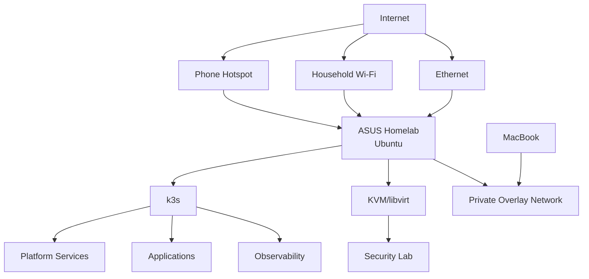

# Architecture Overview

## Physical Architecture



## Availability

This is intentionally a single-node cluster, so there is no compute, storage, or network HA.

## Startup Goal

```text
power on
  -> Ubuntu
  -> network
  -> k3s
  -> GitOps
  -> services healthy
```

## Shutdown Goal

A normal `sudo shutdown now` must remain safe.
