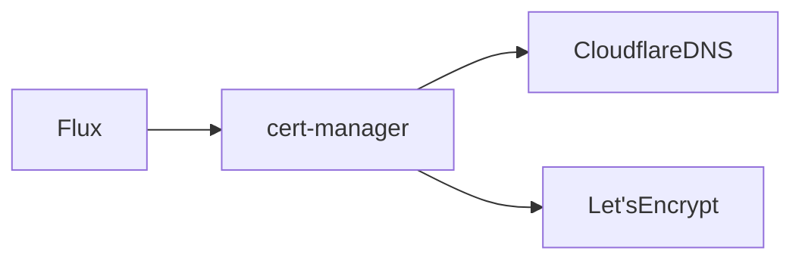

# cert-manager

## Table of Contents

- [Overview](#overview)
- [Role in the Stack](#role-in-the-stack)
- [Architecture](#architecture)
- [Dependencies](#dependencies)
- [Resources](#resources)
- [Networking](#networking)
- [Storage](#storage)
- [Security](#security)
- [Secrets](#secrets)
- [Implementation](#implementation)
- [Configuration](#configuration)
- [Validation](#validation)
- [Operations](#operations)
- [Updating](#updating)
- [Rollback](#rollback)
- [Backup and Restore](#backup-and-restore)
- [Safe Removal](#safe-removal)
- [Troubleshooting](#troubleshooting)
- [FAQ](#faq)
- [References](#references)
- [Change Log](#change-log)

## Overview

cert-manager issues and renews Kubernetes TLS certificates. The controller is
deployed by Flux, while Cloudflare DNS-01 activation is staged separately.
Current state: `DEPLOYED`; DNS-01 state: `READY_FOR_EXECUTION` pending CF-001
and encrypted secret setup.

## Role in the Stack

It provides the certificate lifecycle used by future private ingress. If it is
unavailable, existing Secrets continue serving until expiry but renewal stops.

## Architecture



## Dependencies

| Dependency | Required | Purpose |
|---|---:|---|
| k3s / Flux | Yes | Controller lifecycle and desired state |
| Cloudflare API token | Only for DNS-01 | Temporary challenge TXT records |
| Let's Encrypt staging | Staging | Safe pre-production validation |

## Resources

```yaml
resources:
  requests:
    cpu: "<VALUE>"
    memory: "<VALUE>"
  limits:
    cpu: "<VALUE>"
    memory: "<VALUE>"
```

## Networking

### DNS

No public service records are created by cert-manager. The staging certificate
covers `homelab.gvlad.dev` and `*.homelab.gvlad.dev`.

### Ports

| Port | Protocol | Source | Purpose |
|---|---|---|---|
| `<PORT>` | TCP | `<SOURCE>` | `<PURPOSE>` |

## Storage

ACME account keys and issued certificates are Kubernetes Secrets. The
Cloudflare token is a SOPS-encrypted Secret and is not stored in plaintext.

## Security

The token is restricted to the `gvlad.dev` zone. The issuer is not activated
until the token Secret and Flux SOPS decryption key are supplied. Production
ACME is not configured until staging succeeds.

## Secrets

Never insert real credentials. Use placeholders only.

## Implementation

### Git Paths

- Controller: `infra/infrastructure/cert-manager/base`
- Staging issuer/certificate: `infra/infrastructure/cert-manager/staging`
- Secret template: `infra/secrets/templates/cloudflare-api-token.secret.yaml.example`

### Install

The controller is reconciled by `infrastructure-cert-manager`. Staging is
intentionally not in the live Flux root; follow `CF-001` and the staging README
before activation.

## Configuration

The expected Secret is `cloudflare-api-token` in namespace `cert-manager`, key
`api-token`. The staging ACME directory is
`https://acme-staging-v02.api.letsencrypt.org/directory`.

## Validation

```bash
kubectl get clusterissuer letsencrypt-staging-cloudflare
kubectl get certificate -n ingress homelab-wildcard-staging
kubectl describe certificate -n ingress homelab-wildcard-staging
```

## Operations

```bash
flux get all -A
kubectl get challenges,orders -A
```

## Updating

1. Review release notes.
2. Verify backup.
3. Change pinned version.
4. Reconcile.
5. Validate.

## Rollback

```bash
git revert <COMMIT>
git push
```

## Backup and Restore

### Backup

```bash
<COMMAND>
```

### Restore

```bash
<COMMAND>
```

## Safe Removal

1. Determine dependants.
2. Backup state.
3. Remove desired state.
4. Reconcile.
5. Verify.
6. Delete persistent data only intentionally.

## Troubleshooting

### Pod Will Not Start

```bash
kubectl get pods
kubectl describe pod <POD>
kubectl logs <POD>
```

## FAQ

### 1. What does this component do?

It automates ACME certificate issuance and renewal.

### 2. Is it required?

The controller is part of the platform baseline; Cloudflare DNS-01 is optional
until certificates are needed.

### 3. Does it need Internet access?

Yes, DNS-01 requires outbound access to Cloudflare and Let's Encrypt.

### 4. Does it store persistent data?

ACME account keys, certificates, Orders, and Challenges are stored in the
cluster; the token is stored encrypted through SOPS.

### 5. Where is its configuration?

The GitOps paths above and the `sops-age` Secret in `flux-system`.

### 6. Where are its secrets?

The Cloudflare token is under the staging Git path only after SOPS encryption;
the age private key remains outside Git.

### 7. How do I check health?

Use the validation commands above and inspect cert-manager events.

### 8. How do I update it?

Change only pinned chart or issuer configuration after reviewing release notes.

### 9. How do I roll it back?

Revert the Git commit and reconcile; review certificate Secret deletion first.

### 10. How do I remove it?

Suspend or remove the relevant Flux Kustomization only after checking
dependants and certificate Secret retention.

## References

- https://cert-manager.io/docs/configuration/acme/dns01/cloudflare/
- https://cert-manager.io/docs/tutorials/acme/dns-validation/
- https://developers.cloudflare.com/fundamentals/api/reference/permissions/

## Change Log

| Date | Change |
|---|---|
| 2026-09-13 | Added staged Cloudflare DNS-01 workflow and wildcard certificate preparation |
